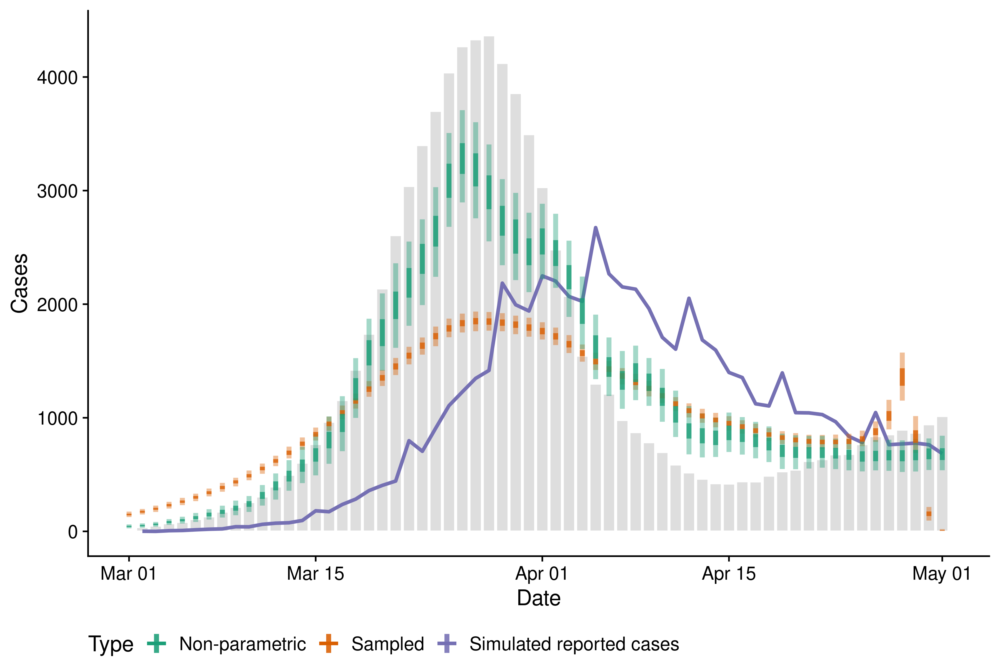
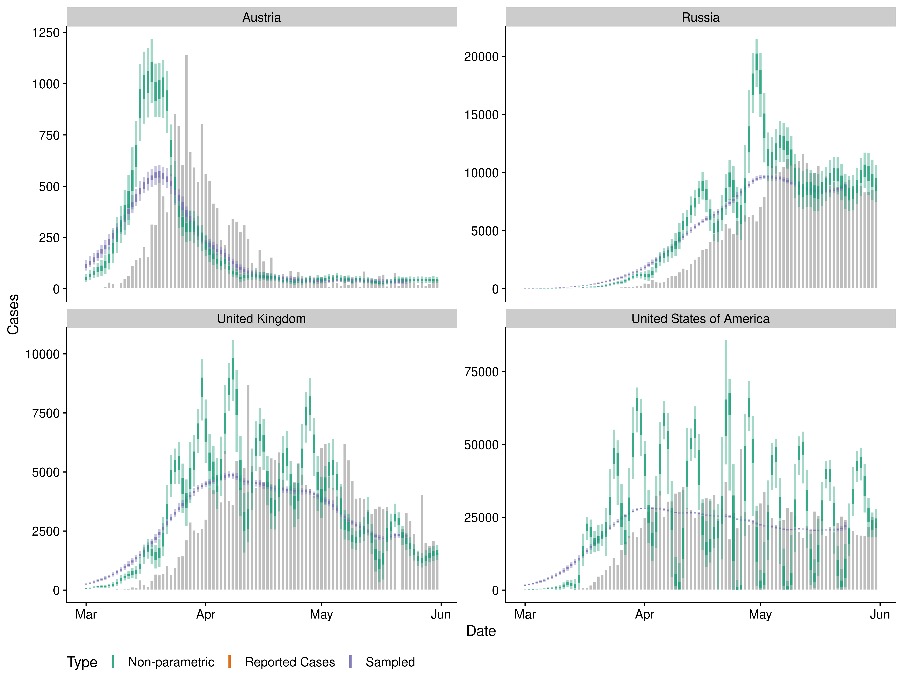

Evaluating approaches to backcalculating cases counts by date of
infection from cases counts by date of report
================

**Authors:** EpiForecasts, CMMID Covid working group, Sebastian Funk

## Summary

  - The current methods being used to backcalculate case counts by date
    of infection assume either a constant shift (typically by the
    mean/median of the delay from onset to report and the mean/median of
    the incubation period) or assume independence between cases and
    sample both the delay from onset to report and the incubation
    period.

  - Parametric approaches are problematic in that they make assumptions
    about the data generating process that may not be correct.

  - Here we evaluate a non-parametric approach that is based on
    convoluting the known delays in comparison to our currently deployed
    independent sampling method.

  - We find that the non-parametric approach is better able to reproduce
    simulated data and returns plausible results when used on reported
    Covid-19 cases from 4 countries.

  - These findings are preliminary and more methodological work is
    required along with comparisons to other approaches.

## Introduction

## Dependencies

## Methods

### Model

  - Overview: non-parameteric backcalculation assuming a median shift
    with independent gaussian noise.

  - Orginal implementation here:
    <https://github.com/jhellewell14/rtconfirm/blob/master/R/backcalc.R>

  - This implementation uses median shifted reported cases (smoothed
    using a rolling average over the width of the median generation
    interval) as a prior and then fits independent gaussian noise on top
    of this. For future cases (i.e with no data to shift to into the
    last reported case count is used).

  - Weekend and monday effects are included as multiplicative terms
    (*Currently off as they introduce oscillations*).

  - Reporting delays and incubation periods are passed in so uncertainty
    can only be generated by passing in multiple samples (causes a
    non-linear slow down) or fitting the model multiple times (each
    model run is ~ 3 - 4 seconds).

  - An alternative would be jointly fitting the delays and case counts
    but I can’t see how fitting the delays in the model in any way can
    be a good thing as I don’t think it will be identifiable.

<!-- end list -->

``` r
model
#> S4 class stanmodel 'nowcast' coded as follows:
#> functions {
#>   // Convolve a pdf and case vector using matrix multiplication
#>   vector convolve(vector cases, vector pdf) {
#>     int t = num_elements(cases);
#>     matrix[t, t] delay_mat = rep_matrix(0, t, t);
#>     int max_pdf = num_elements(pdf);
#>     row_vector[max_pdf] row_pdf = to_row_vector(pdf);
#>     vector[t] convolved_cases;
#>     
#>     for (s in 1:t) {
#>       int max_length = min(s, max_pdf);
#>       delay_mat[s, (s - max_length + 1):s] = row_pdf[(max_pdf - max_length + 1):max_pdf];
#>     }
#>   
#>    convolved_cases = delay_mat * to_vector(cases);
#> 
#>    return convolved_cases;
#>   }
#> }
#> 
#> 
#> data {
#>   int t; // number of time steps
#>   int d; 
#>   int inc; 
#>   int samples;
#>   int wkd[t];
#>   int mon[t];
#>   int <lower = 0> cases[t];
#>   vector<lower = 0>[t] shifted_cases; 
#>   int model_type; //Type of model: 1 = Poisson otherwise negative binomial
#>   vector[d] delay[samples]; 
#>   vector[inc] incubation[samples];
#> }
#> 
#> transformed data{
#>   vector[d] rev_delay[samples];
#>   vector[inc] rev_incubation[samples];
#>   //Reverse the distributions to allow vectorised access
#>   for (h in 1:samples) {
#>     for (j in 1:d) {
#>       rev_delay[h][j] = delay[h][d - j + 1];
#>     }
#>    
#>     for (j in 1:inc) {
#>       rev_incubation[h][j] = incubation[h][inc - j + 1];
#>     }
#>   }
#>   
#> }
#> 
#> parameters{
#>   vector<lower = 0>[t] noise;
#>   real<lower = 0> phi; 
#>   real wkd_eff;
#>   real mon_eff;
#> }
#> 
#> transformed parameters {
#>   vector<lower = 0>[t] infections;
#>   vector<lower = 0>[t] onsets[samples];
#>   vector<lower = 0>[t] reports[samples];
#>   
#>   //Generation infections from median shifted cases and non-parameteric noise
#>   infections = shifted_cases .* noise;
#> 
#>   
#>   for(h in 1:samples) {
#>      // Onsets from infections
#>      onsets[h] = convolve(infections, rev_incubation[h]);
#>      
#>      // Reports from onsets
#>      reports[h] = convolve(onsets[h], rev_delay[h]);
#>      
#>      // Add reporting effects
#>   //   for (s in 1:t) {
#>   //      reports[h, s] = reports[h, s] + (1 + (wkd_eff * wkd[s]) + (mon_eff * mon[s]));
#>   //   }
#>   }
#> }
#> 
#> model {
#>   // Week effects
#>   wkd_eff ~ normal(0, 0.05);
#>   mon_eff ~ normal(0, 0.05);
#>   
#>   // Reporting overdispersion
#>   phi ~ exponential(1);
#> 
#>   // Noise on median shift
#>   for (i in 1:t) {
#>     noise[i] ~ normal(1, 0.1) T[0,];
#>   }
#>   
#>   for (h in 1:samples) {
#>     // Log likelihood of reports
#>      if (model_type == 1) {
#>        target +=  poisson_lpmf(cases | reports[h]);
#>      }else{
#>        target += neg_binomial_2_lpmf(cases | reports[h], phi);
#>      }
#>   }
#> 
#> }
#>   
#> generated quantities {
#>   int imputed_infections[t];
#>   imputed_infections = poisson_rng(infections);
#> }
```

## Analysis

### Simulate data

  - Define a realistic basic reproduction number estimate that starts at
    2, decreases linearly to 0.5, remains constant, increases linearly
    to 1.2 and then again remains constant.

<!-- end list -->

``` r
## Define an initial rt vector 
rts <- c(rep(2, 20), (2 - 1:15 * 0.1), rep(0.5, 10), (0.5 + 1:7 * 0.1), rep(1.2, 10))
rts
#>  [1] 2.0 2.0 2.0 2.0 2.0 2.0 2.0 2.0 2.0 2.0 2.0 2.0 2.0 2.0 2.0 2.0 2.0 2.0 2.0
#> [20] 2.0 1.9 1.8 1.7 1.6 1.5 1.4 1.3 1.2 1.1 1.0 0.9 0.8 0.7 0.6 0.5 0.5 0.5 0.5
#> [39] 0.5 0.5 0.5 0.5 0.5 0.5 0.5 0.6 0.7 0.8 0.9 1.0 1.1 1.2 1.2 1.2 1.2 1.2 1.2
#> [58] 1.2 1.2 1.2 1.2 1.2
```

  - In order to simulate cases by date of infection from a reproduction
    number trace an estimate of the generation interval is required. We
    use the current default estimate for Covid-19 from `EpiNow`.

<!-- end list -->

``` r
## Use the mean default generation interval for covid
generation_interval <- rowMeans(EpiNow::covid_generation_times)

generation_interval
#>  [1] 0.000000e+00 2.063055e-01 1.887694e-01 1.602335e-01 1.240479e-01
#>  [6] 9.071765e-02 6.487144e-02 4.603137e-02 3.269885e-02 2.340093e-02
#> [11] 1.673225e-02 1.204701e-02 8.778529e-03 6.435373e-03 4.739174e-03
#> [16] 3.587893e-03 2.700888e-03 2.063697e-03 1.558217e-03 1.195100e-03
#> [21] 9.091163e-04 6.717316e-04 5.056617e-04 3.622574e-04 2.497779e-04
#> [26] 1.576857e-04 1.031422e-04 6.222018e-05 3.392786e-05 1.669864e-05
#> [31] 7.260972e-06 3.493567e-06 1.600534e-06 6.507847e-07 1.398601e-07
```

``` r
## Sample a report delay as a lognormal - take 10 samples
delay_defs <- EpiNow::lognorm_dist_def(mean = 5, mean_sd = 1,
                                      sd = 3, sd_sd = 1, max_value = 30,
                                      to_log = TRUE, samples = 10)


## Sample a incubation period (again using the default for covid) - take 10 samples
incubation_defs <- EpiNow::lognorm_dist_def(mean = EpiNow::covid_incubation_period[1, ]$mean,
                                           mean_sd = EpiNow::covid_incubation_period[1, ]$mean_sd,
                                           sd = EpiNow::covid_incubation_period[1, ]$sd,
                                           sd_sd = EpiNow::covid_incubation_period[1, ]$sd_sd,
                                           max_value = 30, samples = 10)

## Simulate cases with a decrease in reporting at weekends and an incease on Monday
## using a single sample of both distributions                                    
simulated_cases <- EpiNow::simulate_cases(rts, initial_cases = 100 , initial_date = as.Date("2020-03-01"),
                                          generation_interval = generation_interval, delay_def = delay_defs[1, ],
                                          incubation_def = incubation_defs[1, ],
                                          reporting_effect = c(1.2, rep(1, 4), 0.9, 0.9))
simulated_cases
#>            date cases reference
#>   1: 2020-03-02    36 infection
#>   2: 2020-03-03    49 infection
#>   3: 2020-03-04    70 infection
#>   4: 2020-03-05    82 infection
#>   5: 2020-03-06   107 infection
#>  ---                           
#> 179: 2020-04-27   763    report
#> 180: 2020-04-28   770    report
#> 181: 2020-04-29   777    report
#> 182: 2020-04-30   763    report
#> 183: 2020-05-01   684    report
```

### Compare approaches on simulated data

``` r
## Extract simulated infections
simulated_reports <- simulated_cases[reference == "report"][, confirm := cases][, cases := NULL]

# Median covid generation interval - used to smooth prior cases by date of infection
generation_interval <- rowMeans(EpiNow::covid_generation_times)
generation_interval <- sum(!(cumsum(generation_interval) > 0.5)) + 1   

## Reconstruction via backwards sampling
sampling_cases <- nowcast_pipeline(reported_cases = simulated_reports[, import_status := "local"], 
                                   target_date = max(simulated_reports$date),
                                   delay_defs = delay_defs[1,][, cbind(.SD, sample = 1:1000)],
                                   incubation_defs = incubation_defs[1,][, cbind(.SD, sample = 1:1000)],
                                   nowcast_lag = 0, approx_delay = TRUE)

## Non-parameteric reconstruction
non_parametric_cases <- nowcast(simulated_reports,
                                family = "poisson", delay_defs = delay_defs[1,], 
                                incubation_defs = incubation_defs[1,], 
                                generation_interval = generation_interval, cores = 2,
                                return_all = TRUE, model = model)
```

### Compare approaches on reported Covid-19 cases in the United Kingdom, United States of America and South Korea

  - Get
data

<!-- end list -->

``` r
reported_cases <- NCoVUtils::get_ecdc_cases(countries = c("Austria", "United_Kingdom",
                                                          "United_States_of_America", "Russia"))
reported_cases <- NCoVUtils::format_ecdc_data(reported_cases)
reported_cases <- data.table::as.data.table(reported_cases)[, confirm := cases][, cases := NULL]
reported_cases <- reported_cases[date >= "2020-02-01"]
```

  - Run backcalculation on each country in
turn

<!-- end list -->

``` r
countries <- c("Austria", "United Kingdom", "United States of America", "Russia")

results <- lapply(countries,
                  function(country) {
        message("Nowcasting using sampling for: ", country)                
        cases <- data.table::copy(reported_cases)[region %in% country]  
                                        
        ## Reconstruction via backwards sampling
        sampling_cases <- nowcast_pipeline(reported_cases = cases[, import_status := "local"], 
                                           target_date = max(cases$date),
                                           delay_defs = delay_defs[, cbind(.SD, sample = 1:100)],
                                           incubation_defs = incubation_defs[, cbind(.SD, sample = 1:100)],
                                           approx_delay = TRUE)
        
        message("Non-parametric nowcasting for: ", country)
        ## Non-parametric reconstruction
        non_parametric_cases <- nowcast(cases,
                                        family = "poisson",
                                        delay_defs = delay_defs, incubation_defs = incubation_defs,
                                        generation_interval = generation_interval, cores = 1,
                                        return_all = TRUE, model = model)
        
        return(list(sampling_cases, non_parametric_cases))
                                       })

names(results) <- countries
```

## Results

### Simulated data

  - Reporting effects. *We do not recover the supplied reporting
    effects.*

<!-- end list -->

``` r
summary(non_parametric_cases$wkd_eff$value)
#>       Min.    1st Qu.     Median       Mean    3rd Qu.       Max. 
#> -0.1624922 -0.0318217 -0.0002617  0.0009404  0.0339544  0.1603472

summary(non_parametric_cases$mon_eff$value)
#>       Min.    1st Qu.     Median       Mean    3rd Qu.       Max. 
#> -0.1642350 -0.0334047  0.0016804  0.0003967  0.0343018  0.1487174
```

  - Prepare data for
plotting

<!-- end list -->

``` r
simulated_cases <- simulated_cases[reference %in% c("infection", "report")][, median := cases][,
                                   type := ifelse(reference == "infection", 
                                                  "Simulated infections", 
                                                  "Simulated reported cases")][,
                                   `:=`(cases = NULL, reference = NULL)]

summarise_nowcasting_approaches <- function(sampling_cases, non_parametric_cases) {
  sampling_cases <- sampling_cases[type %in% "infection_upscaled"][,
               .(median = median(cases), bottom = quantile(cases, 0.025),
                 lower = quantile(cases, 0.25), upper = quantile(cases, 0.75),
                 top = quantile(cases, 0.975)), by = c("date", "type")][,
                 type := "Sampled"]

non_parametric_infections <- non_parametric_cases$infections[,
               .(median = median(value), bottom = quantile(value, 0.025),
                 lower = quantile(value, 0.25), upper = quantile(value, 0.75),
                 top = quantile(value, 0.975)), by = c("date")][,
                 type := "Non-parametric"]

out <- data.table::rbindlist(list(sampling_cases, non_parametric_infections), fill = TRUE)
return(out)
}

summarised_nowcasting_approaches <- summarise_nowcasting_approaches(sampling_cases, non_parametric_cases)

simulated_cases <- data.table::rbindlist(list(simulated_cases,
                                              summarised_nowcasting_approaches),
                                         fill = TRUE)
```

  - Plot date. *Note: Here we have cut-off cases prior to the start of
    March. This truncates the long tale observed in the sampling
    approach.*

<!-- end list -->

``` r
plot_data <- simulated_cases[date >= as.Date("2020-03-01")][,
                             type := factor(type, levels = c("Simulated infections",
                                                             "Simulated reported cases",
                                                             "Non-parametric",
                                                             "Sampled"))]
plot <- ggplot2::ggplot(plot_data, ggplot2::aes(x = date, col = type, fill = type)) +
  ggplot2::geom_col(data = plot_data[type %in% "Simulated infections"],
                    ggplot2::aes(y = median), fill = "grey", col = "white", alpha = 0.5) +
  ggplot2::geom_line(data = plot_data[type %in% "Simulated reported cases"],
                      ggplot2::aes(y = median), size = 1.1) +
  ggplot2::geom_linerange(data = plot_data[!type %in% "Simulated infections"],
                          ggplot2::aes(ymin = bottom, ymax = top), 
                         alpha = 0.4, size = 1.5) +
 ggplot2::geom_linerange(data = plot_data[!type %in% "Simulated infections"],
                         ggplot2::aes(ymin = lower, ymax = upper), 
                         alpha = 0.8, size = 1.5) +
  cowplot::theme_cowplot() +
  ggplot2::theme(legend.position = "bottom") +
  ggplot2::scale_color_brewer(palette = "Dark2") +
  ggplot2::labs(y = "Cases", x = "Date", col = "Type")

plot
```



### Reported Covid-19 cases in the United Kingdom, United States of America and South Korea

  - Explore weekend reporting effects by country

<!-- end list -->

``` r
purrr::map(results, ~ summary(.[[2]]$wkd_eff$value))
#> $Austria
#>       Min.    1st Qu.     Median       Mean    3rd Qu.       Max. 
#> -0.1733312 -0.0351102  0.0007206 -0.0006783  0.0318282  0.1813416 
#> 
#> $`United Kingdom`
#>       Min.    1st Qu.     Median       Mean    3rd Qu.       Max. 
#> -1.702e-01 -3.582e-02 -7.415e-05 -4.143e-04  3.650e-02  1.550e-01 
#> 
#> $`United States of America`
#>       Min.    1st Qu.     Median       Mean    3rd Qu.       Max. 
#> -0.1946642 -0.0316083 -0.0006934 -0.0005772  0.0313713  0.1761510 
#> 
#> $Russia
#>       Min.    1st Qu.     Median       Mean    3rd Qu.       Max. 
#> -0.1578733 -0.0346145  0.0005369  0.0005852  0.0341528  0.2013751
```

  - Explore monday reporting effects by country

<!-- end list -->

``` r
purrr::map(results, ~ summary(.[[2]]$mon_eff$value))
#> $Austria
#>      Min.   1st Qu.    Median      Mean   3rd Qu.      Max. 
#> -0.175195 -0.031175  0.001089  0.001348  0.032496  0.149778 
#> 
#> $`United Kingdom`
#>       Min.    1st Qu.     Median       Mean    3rd Qu.       Max. 
#> -1.810e-01 -3.171e-02 -7.333e-04  6.898e-05  3.133e-02  1.508e-01 
#> 
#> $`United States of America`
#>       Min.    1st Qu.     Median       Mean    3rd Qu.       Max. 
#> -0.1423751 -0.0327075  0.0002204  0.0015170  0.0381874  0.1558895 
#> 
#> $Russia
#>      Min.   1st Qu.    Median      Mean   3rd Qu.      Max. 
#> -0.177877 -0.031780  0.001504  0.001113  0.032527  0.138966
```

  - Prepare data for
plotting

<!-- end list -->

``` r
summarised_cases <- data.table::copy(reported_cases)[, median := confirm][, type := "Reported Cases"]


summarised_results <- purrr::map2(results, names(results),
                                  ~ summarise_nowcasting_approaches(.x[[1]], .x[[2]])[, region := .y])

summarised_results <- data.table::rbindlist(summarised_results)
all_country_data <- data.table::rbindlist(list(summarised_cases, summarised_results), fill = TRUE)
all_country_data <- all_country_data[date >= "2020-03-01"]
```

  - Plot
data

<!-- end list -->

``` r
plot <- ggplot2::ggplot(all_country_data, ggplot2::aes(x = date, col = type, fill = type)) +
  ggplot2::geom_col(data = all_country_data[type %in% "Reported Cases"],
                    ggplot2::aes(y = median), fill = "grey", col = "white") +
  ggplot2::geom_linerange(ggplot2::aes(ymin = bottom, ymax = top), 
                         alpha = 0.4, size = 1) +
 ggplot2::geom_linerange(ggplot2::aes(ymin = lower, ymax = upper), 
                         alpha = 0.8, size = 1) +
  cowplot::theme_cowplot() +
  ggplot2::theme(legend.position = "bottom") +
  ggplot2::scale_color_brewer(palette = "Dark2") +
  ggplot2::labs(y = "Cases", x = "Date", col = "Type") + 
  ggplot2::facet_wrap(~region, scales = "free_y")

plot
```



## Discussion

## References
