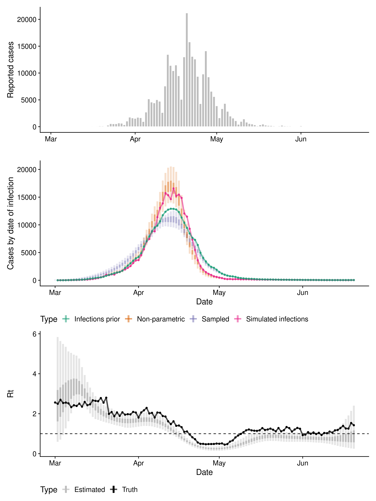
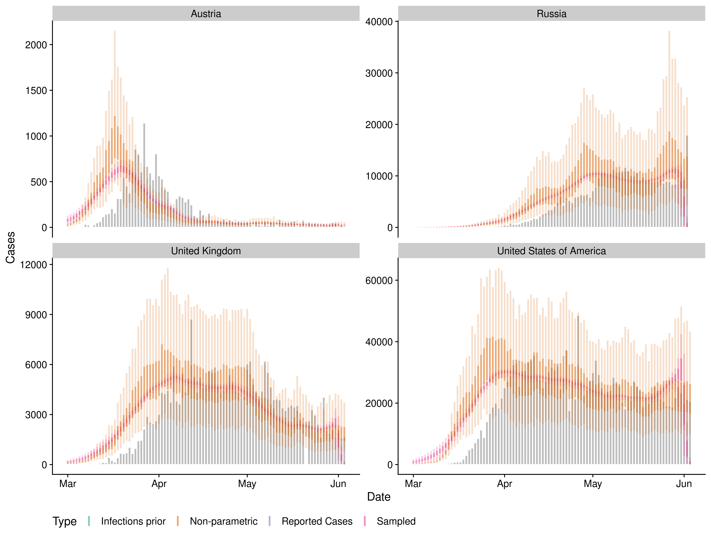

Evaluating approaches to backcalculating cases counts by date of
infection from cases counts by date of report
================

**Authors:** EpiForecasts, CMMID Covid working group, Sebastian Funk

## Summary

  - The current methods being used to backcalculate case counts by date
    of infection assume either a constant shift (typically by the
    mean/median of the delay from onset to report and the mean/median of
    the incubation period) or assume independence between cases and
    sample both the delay from onset to report and the incubation
    period.

  - Parametric approaches are problematic in that they make assumptions
    about the data generating process that may not be correct.

  - Here we evaluate a non-parametric approach that is based on
    convoluting the known delays in comparison to our currently deployed
    independent sampling method.

  - We find that the non-parametric approach is better able to reproduce
    simulated data and returns plausible results when used on reported
    Covid-19 cases from 4 countries.

  - We also implement an in model approach to estimating the
    time-varying reproduction number but this work is at an early stage.

  - These findings are preliminary and more methodological work is
    required along with comparisons to other approaches.

## Introduction

## Dependencies

## Methods

### Model

  - Overview: non-parameteric backcalculation assuming a mean shift with
    gaussian noise.

  - This implementation uses mean shifted reported cases (smoothed using
    a 7 da, backwards looking, rolling average) as a prior combined with
    a guassian process. For future cases (i.e with no data to shift to
    into the last reported case count is used).

  - Fixed daily reporting effects are adjusted for.

  - Uncertainty in reporting delays and incubation periods is enforced
    by upweighting the prior for these parameters.

  - We implement an in model time-varying reproduction number estimation
    step based on the renewal equation, the imputed infections and a
    gaussian process.

<!-- end list -->

``` r
model
#> S4 class stanmodel 'nowcast' coded as follows:
#> functions {
#>   // convolve a pdf and case vector using matrix multiplication
#>   vector convolve(vector cases, vector pdf, int direction) {
#>     int t = num_elements(cases);
#>     matrix[t, t] delay_mat = rep_matrix(0, t, t);
#>     int max_pdf = num_elements(pdf);
#>     row_vector[max_pdf] row_pdf = to_row_vector(pdf);
#>     vector[t] convolved_cases;
#> 
#>     for (s in 1:t) {
#>       if (direction) {
#>         int max_length = min(s, max_pdf);
#>         delay_mat[s, (s - max_length + 1):s] = row_pdf[(max_pdf - max_length + 1):max_pdf];
#>       }else{
#>         int max_length = min(t - s, max_pdf - 1);
#>         delay_mat[s, s:(s + max_length)] = row_pdf[1:(max_length + 1)];
#>       }
#>     }
#>     
#>    convolved_cases = delay_mat * to_vector(cases);
#> 
#>    return(convolved_cases);
#>   }
#> 
#>   // apply backsampling and upscaling based on a pdf
#>   vector backsample(vector cases, vector pdf) {
#>     int t = num_elements(cases);
#>     vector[t] backsampled_cases;
#>     int max_upscale = min(t, num_elements(pdf));
#>     int pdf_length = num_elements(pdf);
#>     vector[pdf_length] cdf;
#>     
#>     backsampled_cases = convolve(cases, pdf, 0);
#>     
#>     // apply upscaling
#>     cdf = cumulative_sum(pdf);
#>     
#>     for (i in  1:max_upscale) {
#>       backsampled_cases[(t - i + 1)] = (backsampled_cases[(t - i + 1)] + 1) / cdf[i];
#>     }
#>     
#>     //bound last day to equal day before
#>     backsampled_cases[t] = backsampled_cases[t -1];
#>     
#>     return(backsampled_cases);
#>   }
#>   
#>   // discretised lognormal pmf
#>   real discretised_lognormal_pmf(int y, real mu, real sigma) {
#>     return((lognormal_cdf(y, mu, sigma) - lognormal_cdf(y - 1, mu, sigma)));
#>   }
#>   
#>   // discretised gamma pmf
#>   real discretised_gamma_pmf(int y, real mu, real sigma) {
#>     // calculate alpha and beta for gamma distribution
#>     real alpha = (mu / sigma)^2;
#>     real beta = mu / (sigma^2);
#>     return((gamma_cdf(y, alpha, beta) - gamma_cdf(y - 1, alpha, beta)));
#>   }
#> }
#> 
#> 
#> data {
#>   int t;                             // number of time steps
#>   int day_of_week[t];                // day of the week indicator (1 - 7)
#>   int <lower = 0> cases[t];          // observed cases
#>   vector<lower = 0>[t] shifted_cases;// median shifted smoothed cases
#>   real inc_mean_sd;                  // prior sd of mean incubation period
#>   real inc_mean_mean;                // prior mean of mean incubation period
#>   real inc_sd_mean;                  // prior sd of sd of incubation period
#>   real inc_sd_sd;                    // prior sd of sd of incubation period
#>   int max_inc;                       // maximum incubation period
#>   real rep_mean_mean;                // prior mean of mean reporting delay
#>   real rep_mean_sd;                  // prior sd of mean reporting delay
#>   real rep_sd_mean;                  // prior mean of sd of reporting delay
#>   real rep_sd_sd;                    // prior sd of sd of reporting delay
#>   int max_rep;                       // maximum report delay
#>   real <lower = 0> r_mean;           // prior mean of reproduction number
#>   real <lower = 0> r_sd;             // prior standard deviation of reproduction number
#>   real gt_mean_sd;                   // prior sd of mean generation time
#>   real gt_mean_mean;                 // prior mean of mean generation time
#>   real gt_sd_mean;                   // prior sd of sd of generation time
#>   real gt_sd_sd;                     // prior sd of sd of generation time
#>   int max_gt;                        // maximum generation time
#>   int model_type;                    // type of model: 0 = poisson otherwise negative binomial
#>   int estimate_r;                    // should the reproduction no be estimated (1 = yes)
#> }
#> 
#> transformed data{
#>   real r_alpha;                      // alpha parameter of the R gamma prior
#>   real r_beta;                       // beta parameter of the R gamma prior
#>   // real initial_noise_mean;           // initial noise estimate
#>   real delta;
#>   real time[t];
#>   // calculate alpha and beta for gamma distribution
#>   r_alpha = (r_mean / r_sd)^2;
#>   r_beta = r_mean / (r_sd^2);
#>   
#>    delta = 1e-9;
#>    for (s in 1:t) {
#>      time[s] = s;
#>    }
#> }
#> parameters{
#>   // real<lower = 0> initial_noise;                      // initial noise on the mean shifted observed cases
#>   // vector<lower = 0>[t -1] noise_diff;                 // temporal scaling on noise
#>   simplex[7] day_of_week_eff_raw;                     // day of week reporting effect + control parameters
#>   real <lower = 0> inc_mean;                          // mean of incubation period
#>   real <lower = 0> inc_sd;                            // sd of incubation period
#>   real <lower = 0> rep_mean;                          // mean of reporting delay
#>   real <lower = 0> rep_sd;                            // sd of incubation period
#>   real<lower = 0> rep_phi[model_type];                // overdispersion of the reporting process
#>   vector<lower = 0>[estimate_r] initial_R;        // reproduction number over time
#>   real<lower = 0> gt_mean[estimate_r];                // mean of generation time
#>   real <lower = 0> gt_sd[estimate_r];                 // sd of generation time
#>   real<lower=0> rho;
#>   real<lower=0> alpha;
#>   real<lower=0> sigma;
#>   vector[t] eta;
#>   real<lower = 0> inf_phi[model_type*estimate_r];     // overdispersion of the infection process
#>   real<lower=0> R_rho;
#>   real<lower=0> R_alpha;
#>   real<lower=0> R_sigma;
#>   vector[t] R_eta;
#> }
#> 
#> transformed parameters {
#>   // stored transformed parameters
#>   vector<lower = 0>[t] noise;                             // noise on the mean shifted observed cases
#>   vector<lower = 0>[t] infections;                        // infections over time
#>   vector<lower = 0>[t] reports;                           // reports over time
#>   vector[7] day_of_week_eff;                              // day of the week effect
#>   vector[estimate_r > 0 ? t : 0] branch_reports;          // reports generated by the branching process
#>   vector[estimate_r > 0 ? t : 0] R;                       // reproduction number over time
#>   
#>  {
#>   // temporary transformed parameters
#>   vector[max_rep] rev_delay;                              // reversed report delay pdf
#>   vector[max_inc] rev_incubation;                         // reversed incubation period pdf
#>   vector[t] onsets;                                       // onsets over time
#>   vector[estimate_r > 0 ? max_gt : 0] rev_generation_time;// reversed generation time pdf
#>   vector[estimate_r > 0 ? t : 0] infectiousness;          // infections over time
#>   vector[estimate_r > 0 ? t : 0] branch_onsets;           // onsets generated by the branching process
#>   vector[estimate_r > 0 ? t : 0] branch_infections;       // infections generated by the branching process
#>   matrix[t, t] L_K;
#>   matrix[t, t] K;
#>   vector[estimate_r > 0 ? t : 0] R_noise; 
#>   // reverse the distributions to allow vectorised access
#>   for (j in 1:max_inc) {
#>     rev_incubation[j] =
#>         discretised_lognormal_pmf(max_inc - j + 1, inc_mean, inc_sd);
#>   }
#>   
#>   for (j in 1:(max_rep)) {
#>     rev_delay[j] =
#>         discretised_lognormal_pmf(max_rep - j + 1, rep_mean, rep_sd);
#>   }
#>     
#>   // define day of the week effect
#>   day_of_week_eff = 7 * day_of_week_eff_raw;
#> 
#>   // GP in noise
#>   K = cov_exp_quad(time, alpha, rho);
#>   // diagonal elements with offset to make + definite
#>   for (n in 1:t) {
#>       K[n, n] = K[n, n] + delta;
#>   }
#>   
#>   L_K = cholesky_decompose(K);
#>   noise = exp(L_K * eta);
#>   
#>   for (s in 1:t) {
#>     if (noise[s] == 0) {
#>       noise[s] = 0.0001;
#>     }
#>   }
#>   
#>   // generate infections from prior infections and non-parameteric noise
#>   infections = shifted_cases .* noise;
#>   
#>   // onsets from infections
#>   onsets = convolve(infections, rev_incubation, 1);
#> 
#>   // reports from onsets
#>   reports = convolve(onsets, rev_delay, 1);
#> 
#>   for (s in 1:t) {
#>     // add reporting effects (adjust for simplex scale)
#>     reports[s] *= day_of_week_eff[day_of_week[s]];
#>   }
#>     
#>   ////////////////////////////////////////////////////// 
#>   // estimate reproduction no from a branching process
#>   //////////////////////////////////////////////////////
#>   if (estimate_r) {
#>     // calculate pdf of generation time from distribution
#>     for (j in 1:(max_gt - 1)) {
#>        rev_generation_time[j] =
#>            discretised_gamma_pmf(max_gt - j, gt_mean[estimate_r], gt_sd[estimate_r]);
#>      }
#>      // set same day to be 0
#>      rev_generation_time[max_gt] = 0;
#>      
#>      infectiousness = convolve(infections, rev_generation_time, 1);
#> 
#> 
#>      // Construct R over time
#>         K = cov_exp_quad(time, R_alpha, R_rho);
#>      // diagonal elements with offset to make + definite
#>       for (n in 1:t) {
#>         K[n, n] = K[n, n] + delta;
#>         }
#>         L_K = cholesky_decompose(K);
#>         R_noise = exp(L_K * R_eta);
#>   
#>      // Estimate infections using branching process
#>       for (s in 1:t) {
#>          R[s] = initial_R[estimate_r] * R_noise[s];
#>          branch_infections[s] = R[s] * infectiousness[s];
#>          
#>          // Make sure all dates have a non-zero value
#>          if (branch_infections[s] == 0){
#>             branch_infections[s] = 0.0001; 
#>          }
#>        }
#>      // onsets from infections
#>      branch_onsets = convolve(branch_infections, rev_incubation, 1);
#> 
#>      // reports from onsets
#>      branch_reports = convolve(branch_onsets, rev_delay, 1);
#> 
#>      for (s in 1:t) {
#>       // add reporting effects (adjust for simplex scale)
#>       branch_reports[s] *= (day_of_week_eff[day_of_week[s]]);
#>     }
#>   }
#>  }
#> }
#> 
#> model {
#>   
#>   // priors for noise GP
#>   rho ~ inv_gamma(5, 5);
#>   alpha ~ std_normal();
#>   sigma ~ std_normal();
#>   eta ~ std_normal();
#> 
#>   // reporting overdispersion
#>   if (model_type) {
#>     rep_phi[model_type] ~ exponential(1);
#>   }
#>   
#>   // daily cases given reports
#>   if (model_type) {
#>     target += neg_binomial_2_lpmf(cases | reports, rep_phi[model_type]);
#>   }else{
#>     target += poisson_lpmf(cases | reports);
#>   }
#> 
#>   // penalised priors for incubation period, and report delay
#>   target += normal_lpdf(inc_mean | inc_mean_mean, inc_mean_sd) * t;
#>   target += normal_lpdf(inc_sd | inc_sd_mean, inc_sd_sd) * t;
#>   target += normal_lpdf(rep_mean | rep_mean_mean, rep_mean_sd) * t;
#>   target += normal_lpdf(rep_sd | rep_sd_mean, rep_sd_sd) * t;
#>   
#>   ////////////////////////////////////////////////////// 
#>   // estimate reproduction no from a branching process
#>   //////////////////////////////////////////////////////
#>   if (estimate_r) {
#>     // infection overdispersion
#>     if(model_type) {
#>       inf_phi ~ exponential(1);
#>     }
#> 
#>     // prior on R
#>     initial_R[estimate_r] ~ gamma(r_alpha, r_beta);
#>     
#>    // priors for R gp
#>    R_rho ~ inv_gamma(5, 5);
#>    R_alpha ~ std_normal();
#>    R_sigma ~ std_normal();
#>    R_eta ~ std_normal();
#>     
#>     // penalised_prior on generation interval
#>     target += normal_lpdf(gt_mean | gt_mean_mean, gt_mean_sd) * t;
#>     target += normal_lpdf(gt_sd | gt_sd_mean, gt_sd_sd) * t;
#>     
#>     // Likelihood of Rt given infections
#>     if (model_type) {
#>       target += neg_binomial_2_lpmf(cases | branch_reports, inf_phi[model_type*estimate_r]);
#>     }else{
#>       target += poisson_lpmf(cases | branch_reports);
#>     }
#>   }
#> }
#>   
#> generated quantities {
#>   int imputed_infections[t];
#>   
#>   // simulated infections - assume poisson (with negative binomial reporting)
#>   imputed_infections = poisson_rng(infections);
#> }
```

## Analysis

### Simulate data

  - Define a realistic basic reproduction number estimate that starts at
    2, decreases linearly to 0.5, remains constant, increases linearly
    to 1.2, decreases sharply to 1, again remains constant and finally
    increases linearly. Noise is added (2% standard deviation) for all
    values.

<!-- end list -->

``` r
## Define an initial rt vector 
rts <- c(rep(3, 20), rep(2, 20), (2 - 1:15 * 0.1),
         rep(0.5, 10), (0.5 + 1:7 * 0.1), rep(1.2, 20),
         rep(1, 10), (1 + 1:10 * 0.05))
## Add noise
rts <- rts * rnorm(length(rts), 1, 0.05)

rts
#>   [1] 2.9251014 3.0472482 3.0412565 3.0605497 2.9633515 2.9532579 3.1983202
#>   [8] 3.4004831 2.8643849 2.8796196 2.9410171 3.0000320 2.9605300 2.9817022
#>  [15] 2.5608198 2.9793208 3.0482050 2.9328663 3.0115579 2.8590008 1.9705564
#>  [22] 1.9695237 1.9759641 2.0964652 1.9541899 1.8423787 2.0108903 1.9474523
#>  [29] 1.9378916 1.9637902 2.1214369 1.8569380 1.9544401 2.1200932 2.0404933
#>  [36] 1.9240032 1.8247233 2.0195031 2.0705947 1.8950098 1.9183836 1.7459737
#>  [43] 1.7948173 1.6559631 1.5407088 1.3872239 1.1233438 1.1479951 1.1098573
#>  [50] 1.0731456 0.9356416 0.8354600 0.7191705 0.5830998 0.5166368 0.5413563
#>  [57] 0.5386327 0.4985529 0.5032949 0.5473110 0.4964805 0.4631470 0.5071425
#>  [64] 0.5354710 0.5041420 0.6144161 0.7424042 0.8578720 0.9125797 0.9382654
#>  [71] 1.1195506 1.2568653 1.2359785 1.2628532 1.2107814 1.1709912 1.1366486
#>  [78] 1.1844895 1.2375082 1.1822858 1.2363213 1.1471084 1.1757737 1.2931601
#>  [85] 1.2177903 1.1969346 1.3126287 1.2959558 1.2279802 1.1524000 1.1391526
#>  [92] 1.1999944 1.0356807 0.9948253 1.0825293 1.0621797 1.0195674 0.9695189
#>  [99] 1.1168165 0.9665393 0.9990477 0.9691863 1.1101713 1.1380528 1.1885342
#> [106] 1.2277057 1.2151616 1.4006818 1.2141447 1.4005838 1.3721794 1.5094355
```

  - In order to simulate cases by date of report from a reproduction
    number trace an estimates the incubation period, reporting delay and
    generation time are required. Here defaults from `EpiNow` for
    covid-19 are
used.

<!-- end list -->

``` r
incubation_period <- list(mean = EpiNow::covid_incubation_period[1, ]$mean,
                           mean_sd = EpiNow::covid_incubation_period[1, ]$mean_sd,
                           sd = EpiNow::covid_incubation_period[1, ]$sd,
                           sd_sd = EpiNow::covid_incubation_period[1, ]$sd_sd,
                           max = 30)
                    
reporting_delay <- list(mean = log(5),
                         mean_sd = log(1.1),
                         sd = log(2),
                         sd_sd = log(1.2),
                         max = 30)

generation_time <- list(mean = EpiNow::covid_generation_times_summary[1, ]$mean,
                        mean_sd = EpiNow::covid_generation_times_summary[1, ]$mean_sd,
                        sd = EpiNow::covid_generation_times_summary[1, ]$sd,
                        sd_sd = EpiNow::covid_generation_times_summary[1, ]$sd_sd,
                        max = 30)

generation_time_defs <- EpiNow::gamma_dist_def(mean = generation_time$mean, 
                                               mean_sd = generation_time$mean_sd,
                                               sd = generation_time$sd,
                                               sd_sd = generation_time$sd_sd,
                                               max_value = generation_time$max, samples = 1)

generation_time_pdf <- c(0, EpiNow::dist_skel(n = 0:30, 
                        model = "gamma", 
                        params = generation_time_defs$params[[1]],
                        max_value = 30, 
                        dist = TRUE, cum = FALSE))

## Sample a report delay as a lognormal - take 10 samples
delay_defs <- EpiNow::lognorm_dist_def(mean = reporting_delay$mean, mean_sd = reporting_delay$mean_sd,
                                       sd = reporting_delay$sd, sd_sd = reporting_delay$sd_sd,
                                       max_value = reporting_delay$max, samples = 1000)


## Sample a incubation period (again using the default for covid) - take 10 samples
incubation_defs <- EpiNow::lognorm_dist_def(mean = incubation_period$mean,
                                           mean_sd = incubation_period$mean_sd,
                                           sd = incubation_period$sd,
                                           sd_sd = incubation_period$sd_sd,
                                           max_value = 30, samples = 1000)

## Simulate cases with a decrease in reporting at weekends and an incease on Monday
## using a single sample of both distributions                                    
simulated_cases <- EpiNow::simulate_cases(rts, initial_cases = 10, initial_date = as.Date("2020-03-01"),
                                          generation_interval = generation_time_pdf,
                                          delay_def = delay_defs[10, ],
                                          incubation_def = incubation_defs[10, ],
                                          reporting_effect = c(1.6, 1.2, 1, 1, 0.8, 0.4, 1))
simulated_cases
#>            date cases reference
#>   1: 2020-03-02    11 infection
#>   2: 2020-03-03     7 infection
#>   3: 2020-03-04    12 infection
#>   4: 2020-03-05    14 infection
#>   5: 2020-03-06    26 infection
#>  ---                           
#> 324: 2020-06-16   768    report
#> 325: 2020-06-17   624    report
#> 326: 2020-06-18   618    report
#> 327: 2020-06-19   476    report
#> 328: 2020-06-20   261    report
```

### Compare approaches on simulated data

``` r
## Extract simulated infections
simulated_reports <- simulated_cases[reference == "report"][, confirm := cases][,
                                     cases := NULL][date >= as.Date("2020-03-11")]

## Rt prior
rt_prior <- list(mean = 2.6, sd = 2)

## Reconstruction via backwards sampling
sampling_cases <- nowcast_pipeline(reported_cases = simulated_reports[, import_status := "local"], 
                                   target_date = max(simulated_reports$date),
                                   delay_defs = delay_defs, 
                                   incubation_defs = incubation_defs,
                                   nowcast_lag = 0, approx_delay = TRUE)

## Non-parameteric reconstruction
non_parametric_cases <- nowcast(simulated_reports,
                                family = "negbin",
                                incubation_period = incubation_period,
                                reporting_delay = reporting_delay,
                                generation_time = generation_time, 
                                estimate_rt = TRUE,
                                rt_prior = rt_prior,
                                cores = 4, chains = 4,
                                samples = 1000, warmup = 1000,
                                return_all = TRUE, model = model,
                                verbose = TRUE)
#> Running for 2000 samples and 112 time steps
#> Warning: Bulk Effective Samples Size (ESS) is too low, indicating posterior means and medians may be unreliable.
#> Running the chains for more iterations may help. See
#> http://mc-stan.org/misc/warnings.html#bulk-ess
#> Warning: Tail Effective Samples Size (ESS) is too low, indicating posterior variances and tail quantiles may be unreliable.
#> Running the chains for more iterations may help. See
#> http://mc-stan.org/misc/warnings.html#tail-ess
```

### Compare approaches on reported Covid-19 cases in Austria, the United Kingdom, United States of America and Russia

  - Get
data

<!-- end list -->

``` r
reported_cases <- NCoVUtils::get_ecdc_cases(countries = c("Austria", "United_Kingdom",
                                                          "United_States_of_America", "Russia"))
reported_cases <- NCoVUtils::format_ecdc_data(reported_cases)
reported_cases <- data.table::as.data.table(reported_cases)[, confirm := cases][, cases := NULL]
reported_cases <- reported_cases[date >= "2020-02-01"]
```

  - Run backcalculation on each country in
turn

<!-- end list -->

``` r
countries <- c("Austria", "United Kingdom", "United States of America", "Russia")

results <- lapply(countries,
                  function(country) {
        message("Nowcasting using sampling for: ", country)                
        cases <- data.table::copy(reported_cases)[region %in% country]  
                                        
        ## Reconstruction via backwards sampling
        sampling_cases <- nowcast_pipeline(reported_cases = cases[, import_status := "local"], 
                                           target_date = max(cases$date),
                                           delay_defs = delay_defs,
                                           incubation_defs = incubation_defs,
                                           nowcast_lag = 0, approx_delay = TRUE)
        
        message("Non-parametric nowcasting for: ", country)
        ## Non-parametric reconstruction
        non_parametric_cases <- nowcast(cases,
                                        family = "negbin",
                                        incubation_period = incubation_period,
                                        reporting_delay = reporting_delay,
                                        generation_time = generation_time, 
                                        estimate_rt = FALSE,
                                        samples = 2000, warmup = 1000,
                                        cores = 4, chains = 4,
                                        return_all = TRUE, model = model)
        
        return(list(sampling_cases, non_parametric_cases))
                                       })
#> Warning: There were 8000 divergent transitions after warmup. Increasing adapt_delta above 0.96 may help. See
#> http://mc-stan.org/misc/warnings.html#divergent-transitions-after-warmup
#> Warning: Examine the pairs() plot to diagnose sampling problems
#> Warning: The largest R-hat is 4.03, indicating chains have not mixed.
#> Running the chains for more iterations may help. See
#> http://mc-stan.org/misc/warnings.html#r-hat
#> Warning: Bulk Effective Samples Size (ESS) is too low, indicating posterior means and medians may be unreliable.
#> Running the chains for more iterations may help. See
#> http://mc-stan.org/misc/warnings.html#bulk-ess
#> Warning: Tail Effective Samples Size (ESS) is too low, indicating posterior variances and tail quantiles may be unreliable.
#> Running the chains for more iterations may help. See
#> http://mc-stan.org/misc/warnings.html#tail-ess
#> Warning: There were 8000 divergent transitions after warmup. Increasing adapt_delta above 0.96 may help. See
#> http://mc-stan.org/misc/warnings.html#divergent-transitions-after-warmup
#> Warning: Examine the pairs() plot to diagnose sampling problems
#> Warning: The largest R-hat is NA, indicating chains have not mixed.
#> Running the chains for more iterations may help. See
#> http://mc-stan.org/misc/warnings.html#r-hat
#> Warning: Bulk Effective Samples Size (ESS) is too low, indicating posterior means and medians may be unreliable.
#> Running the chains for more iterations may help. See
#> http://mc-stan.org/misc/warnings.html#bulk-ess
#> Warning: Tail Effective Samples Size (ESS) is too low, indicating posterior variances and tail quantiles may be unreliable.
#> Running the chains for more iterations may help. See
#> http://mc-stan.org/misc/warnings.html#tail-ess
#> Warning: There were 8000 divergent transitions after warmup. Increasing adapt_delta above 0.96 may help. See
#> http://mc-stan.org/misc/warnings.html#divergent-transitions-after-warmup
#> Warning: Examine the pairs() plot to diagnose sampling problems
#> Warning: The largest R-hat is 3.72, indicating chains have not mixed.
#> Running the chains for more iterations may help. See
#> http://mc-stan.org/misc/warnings.html#r-hat
#> Warning: Bulk Effective Samples Size (ESS) is too low, indicating posterior means and medians may be unreliable.
#> Running the chains for more iterations may help. See
#> http://mc-stan.org/misc/warnings.html#bulk-ess
#> Warning: Tail Effective Samples Size (ESS) is too low, indicating posterior variances and tail quantiles may be unreliable.
#> Running the chains for more iterations may help. See
#> http://mc-stan.org/misc/warnings.html#tail-ess
#> Warning: There were 8000 divergent transitions after warmup. Increasing adapt_delta above 0.96 may help. See
#> http://mc-stan.org/misc/warnings.html#divergent-transitions-after-warmup
#> Warning: Examine the pairs() plot to diagnose sampling problems
#> Warning: The largest R-hat is NA, indicating chains have not mixed.
#> Running the chains for more iterations may help. See
#> http://mc-stan.org/misc/warnings.html#r-hat
#> Warning: Bulk Effective Samples Size (ESS) is too low, indicating posterior means and medians may be unreliable.
#> Running the chains for more iterations may help. See
#> http://mc-stan.org/misc/warnings.html#bulk-ess
#> Warning: Tail Effective Samples Size (ESS) is too low, indicating posterior variances and tail quantiles may be unreliable.
#> Running the chains for more iterations may help. See
#> http://mc-stan.org/misc/warnings.html#tail-ess

names(results) <- countries
```

## Results

### Simulated data

  - Reporting effects.

<!-- end list -->

``` r
non_parametric_cases$day_of_week[, as.list(summary(value)), by = "wday"]
#>         wday      Min.   1st Qu.    Median      Mean   3rd Qu.      Max.
#> 1:    Monday 1.4523396 1.5445129 1.5720861 1.5728385 1.6008744 1.7267483
#> 2:   Tuesday 1.0925022 1.1733173 1.1961190 1.1965304 1.2193247 1.3476431
#> 3: Wednesday 0.9258247 0.9962349 1.0161505 1.0169390 1.0371041 1.1371118
#> 4:  Thursday 0.8672873 0.9713424 0.9910990 0.9914691 1.0108349 1.1260308
#> 5:    Friday 0.7220486 0.7919479 0.8077268 0.8084244 0.8239178 0.9032060
#> 6:  Saturday 0.3512735 0.3981429 0.4067982 0.4071372 0.4156700 0.4653248
#> 7:    Sunday 0.9036968 0.9868476 1.0064746 1.0066614 1.0262621 1.1151005
```

  - Recover reporting delays

<!-- end list -->

``` r
data.table::rbindlist(list(
  non_parametric_cases$rep_mean[, .(parameter = "mean", mean = mean(value), sd = sd(value))],
  non_parametric_cases$rep_sd[, .(parameter = "sd", mean = mean(value), sd = sd(value))]
))
#>    parameter      mean          sd
#> 1:      mean 1.6084201 0.008912077
#> 2:        sd 0.6903552 0.016887086
```

  - Recover incubation period

<!-- end list -->

``` r
data.table::rbindlist(list(
  non_parametric_cases$inc_mean[, .(parameter = "mean", mean = mean(value), sd = sd(value))],
  non_parametric_cases$inc_sd[, .(parameter = "sd", mean = mean(value), sd = sd(value))]
))
#>    parameter      mean          sd
#> 1:      mean 1.6206981 0.006074767
#> 2:        sd 0.4176054 0.006584897
```

  - Recover generation time

<!-- end list -->

``` r
data.table::rbindlist(list(
  non_parametric_cases$gt_mean[, .(parameter = "mean", mean = mean(value), sd = sd(value))],
  non_parametric_cases$gt_sd[, .(parameter = "sd", mean = mean(value), sd = sd(value))]
))
#>    parameter     mean         sd
#> 1:      mean 3.622522 0.06673622
#> 2:        sd 3.080378 0.07054938
```

  - Prepare data for
plotting

<!-- end list -->

``` r
simulated_cases <- simulated_cases[reference %in% c("infection", "report")][, median := cases][,
                                   type := ifelse(reference == "infection", 
                                                  "Simulated infections", 
                                                  "Simulated reported cases")][,
                                   `:=`(cases = NULL, reference = NULL)]

summarise_nowcasting_approaches <- function(sampling_cases, non_parametric_cases) {
  sampling_cases <- sampling_cases[type %in% "infection_upscaled"][,
               .(median = median(cases), bottom = quantile(cases, 0.025),
                 lower = quantile(cases, 0.25), upper = quantile(cases, 0.75),
                 top = quantile(cases, 0.975)), by = c("date", "type")][,
                 type := "Sampled"]

non_parametric_infections <- non_parametric_cases$infections[,
               .(median = median(value), bottom = quantile(value, 0.025),
                 lower = quantile(value, 0.25), upper = quantile(value, 0.75),
                 top = quantile(value, 0.975)), by = c("date")][,
                 type := "Non-parametric"]

non_parametric_prior_infections <- non_parametric_cases$prior_infections[sample == 1,
               .(median = value), by = c("date")][,
                 type := "Infections prior"]
out <- data.table::rbindlist(list(sampling_cases, non_parametric_infections,
                                  non_parametric_prior_infections), fill = TRUE)
return(out)
}

summarised_nowcasting_approaches <- summarise_nowcasting_approaches(sampling_cases, non_parametric_cases)

simulated_cases <- data.table::rbindlist(list(simulated_cases,
                                              summarised_nowcasting_approaches),
                                         fill = TRUE)
```

  - Extract Rt
estimates

<!-- end list -->

``` r
rt_sim <- non_parametric_cases$R[, .(median = median(value), bottom = quantile(value, 0.025),
                 lower = quantile(value, 0.25), upper = quantile(value, 0.75),
                 top = quantile(value, 0.975), type = "Estimated"), by = c("date")]


rts <- data.table::data.table(
    date = seq(as.Date("2020-03-01"), 
               as.Date("2020-03-01") + lubridate::days(length(rts) - 1), by = "days"),
    median = rts,
    type = "Truth"
  )

rt_sim <- data.table::rbindlist(list(rts, rt_sim), fill = TRUE)
rt_sim <- rt_sim[date >= as.Date("2020-03-01")][,
                 type := factor(type, levels = c("Truth", "Estimated"))]
```

  - Plot example simulation. *Note: Here we have cut-off cases prior to
    the start of March. This truncates the long tale observed in the
    sampling approach.*

<!-- end list -->

``` r
plot_data <- simulated_cases[date >= as.Date("2020-03-01")]

plot_obs <- ggplot2::ggplot(plot_data[type %in% "Simulated reported cases"], 
                           ggplot2::aes(x = date, col = type, fill = type)) +
  ggplot2::geom_col(ggplot2::aes(y = median), fill = "grey", col = "white",
                    show.legend = FALSE) +
  cowplot::theme_cowplot() +
  ggplot2::theme(legend.position = "none") +
  ggplot2::scale_color_brewer(palette = "Dark2") +
  ggplot2::labs(y = "Reported cases", x = "")


plot_sims_data <- plot_data[!type %in% "Simulated reported cases"][,
                             type := factor(type, levels = c("Simulated infections",
                                                             "Sampled",
                                                             "Infections prior",
                                                             "Non-parametric"))]
plot <- ggplot2::ggplot(plot_sims_data, ggplot2::aes(x = date, col = type, fill = type)) +
 ggplot2::geom_linerange(data = plot_sims_data[!type %in% "Simulated infections"],
                          ggplot2::aes(ymin = bottom, ymax = top), 
                         alpha = 0.2, size = 1.5) +
 ggplot2::geom_linerange(data = plot_sims_data[!type %in% "Simulated infections"],
                         ggplot2::aes(ymin = lower, ymax = upper), 
                         alpha = 0.4, size = 1.5) +
 ggplot2::geom_line(data = plot_sims_data[type %in% c("Simulated infections", "Infections prior")],
                    ggplot2::aes(y = median), size = 1.1, alpha = 0.6) +
 ggplot2::geom_point(data = plot_sims_data[type %in%  c("Simulated infections", "Infections prior")],
                     ggplot2::aes(y = median), size = 1.1, alpha = 0.8, show.legend = FALSE) +
  cowplot::theme_cowplot() +
  ggplot2::theme(legend.position = "bottom") +
  ggplot2::scale_color_brewer(palette = "Dark2") +
  ggplot2::labs(y = "Cases by date of infection", x = "Date", col = "Type")


plot_rt <- ggplot2::ggplot(rt_sim, ggplot2::aes(x = date, col = type, fill = type)) +
   ggplot2::geom_linerange(data = rt_sim[!type %in% "Truth"],
                          ggplot2::aes(ymin = bottom, ymax = top), 
                         alpha = 0.4, size = 1.5) +
 ggplot2::geom_linerange(data = rt_sim[!type %in% "Truth"],
                         ggplot2::aes(ymin = lower, ymax = upper), 
                         alpha = 1, size = 1.5) +
 ggplot2::geom_line(data =  rt_sim[type %in% "Truth"],
                    ggplot2::aes(y = median), size = 1.1, alpha = 0.7) +
 ggplot2::geom_point(data =  rt_sim[type %in% "Truth"],
                    ggplot2::aes(y = median), size = 1.1, alpha = 1, 
                    show.legend = FALSE) +
  ggplot2::geom_hline(yintercept = 1, linetype = 2) + 
  cowplot::theme_cowplot() +
  ggplot2::theme(legend.position = "bottom") +
  ggplot2::scale_color_manual(values = c("grey", "black")) +
  ggplot2::labs(y = "Rt", x = "Date", col = "Type")

plot_obs + 
  plot + 
  plot_rt +
  patchwork::plot_layout(ncol = 1)
```



### Reported Covid-19 cases in the United Kingdom, United States of America and South Korea

  - Explore reporting effects by
country

<!-- end list -->

``` r
purrr::map(results, ~ .[[2]]$day_of_week[, as.list(summary(value)), by = "wday"])
#> $Austria
#>         wday      Min.   1st Qu.    Median      Mean   3rd Qu.     Max.
#> 1:    Monday 0.4388644 0.6580467 0.7173537 0.7226465 0.7910389 1.150684
#> 2:   Tuesday 0.6297730 0.8702780 0.9465357 0.9561109 1.0364923 1.362986
#> 3: Wednesday 0.7238219 0.9519628 1.0326788 1.0341879 1.1070183 1.469356
#> 4:  Thursday 0.6087810 0.8818385 0.9549592 0.9578892 1.0318277 1.438336
#> 5:    Friday 0.7569517 1.0202372 1.0878978 1.0924366 1.1643525 1.622720
#> 6:  Saturday 0.7880604 1.1642169 1.2658221 1.2602139 1.3555986 1.771987
#> 7:    Sunday 0.6098645 0.8930068 0.9681349 0.9765150 1.0430604 1.440625
#> 
#> $`United Kingdom`
#>         wday      Min.   1st Qu.    Median      Mean   3rd Qu.     Max.
#> 1:    Monday 0.6673008 0.9726621 1.0539817 1.0625011 1.1428266 1.523514
#> 2:   Tuesday 0.5810299 0.7650348 0.8175393 0.8262090 0.8810671 1.141571
#> 3: Wednesday 0.6172868 0.8351977 0.9073141 0.9133293 0.9807855 1.353685
#> 4:  Thursday 0.6551371 0.8797493 0.9534933 0.9560895 1.0293088 1.357027
#> 5:    Friday 0.7327787 0.9617027 1.0413192 1.0443169 1.1197173 1.458976
#> 6:  Saturday 0.7274733 0.9923408 1.0646495 1.0710143 1.1448572 1.621488
#> 7:    Sunday 0.7630334 1.0505678 1.1289265 1.1265400 1.2044486 1.605431
#> 
#> $`United States of America`
#>         wday      Min.   1st Qu.    Median      Mean   3rd Qu.     Max.
#> 1:    Monday 0.7456521 0.8628423 0.8948240 0.9011977 0.9355487 1.178224
#> 2:   Tuesday 0.7293539 0.8971247 0.9357369 0.9383118 0.9765429 1.200607
#> 3: Wednesday 0.7469238 0.8844043 0.9231792 0.9240736 0.9604249 1.141192
#> 4:  Thursday 0.7363669 0.9121822 0.9533247 0.9526136 0.9952412 1.207034
#> 5:    Friday 0.8579743 1.0319280 1.0711604 1.0762970 1.1163358 1.313750
#> 6:  Saturday 0.8929871 1.0913465 1.1376817 1.1419343 1.1894226 1.370012
#> 7:    Sunday 0.8816393 1.0206725 1.0629688 1.0655720 1.1069837 1.305468
#> 
#> $Russia
#>         wday      Min.   1st Qu.    Median      Mean   3rd Qu.     Max.
#> 1:    Monday 0.6970652 0.9381205 0.9989090 1.0045912 1.0743978 1.411862
#> 2:   Tuesday 0.7020624 0.8955976 0.9500026 0.9555836 1.0121284 1.309782
#> 3: Wednesday 0.6810854 0.8871486 0.9478277 0.9510582 1.0141076 1.298865
#> 4:  Thursday 0.7494964 0.9762645 1.0445777 1.0477796 1.1127705 1.425515
#> 5:    Friday 0.7278706 0.9417922 1.0044129 1.0074803 1.0658024 1.430936
#> 6:  Saturday 0.7711136 1.0117462 1.0801160 1.0850443 1.1492139 1.533833
#> 7:    Sunday 0.7044830 0.8901611 0.9431140 0.9484628 0.9998864 1.309441
```

  - Prepare data for
plotting

<!-- end list -->

``` r
summarised_cases <- data.table::copy(reported_cases)[, median := confirm][, type := "Reported Cases"]


summarised_results <- purrr::map2(results, names(results),
                                  ~ summarise_nowcasting_approaches(.x[[1]], .x[[2]])[,region := .y])

summarised_results <- data.table::rbindlist(summarised_results)
all_country_data <- data.table::rbindlist(list(summarised_cases, summarised_results), fill = TRUE)
all_country_data <- all_country_data[date >= "2020-03-01"]
```

  - Plot
data

<!-- end list -->

``` r
plot <- ggplot2::ggplot(all_country_data, ggplot2::aes(x = date, col = type, fill = type)) +
  ggplot2::geom_col(data = all_country_data[type %in% "Reported Cases"],
                    ggplot2::aes(y = median), fill = "grey", col = "white") +
  ggplot2::geom_linerange(ggplot2::aes(ymin = bottom, ymax = top), 
                         alpha = 0.2, size = 1) +
 ggplot2::geom_linerange(ggplot2::aes(ymin = lower, ymax = upper), 
                         alpha = 0.4, size = 1) +
  cowplot::theme_cowplot() +
  ggplot2::theme(legend.position = "bottom") +
  ggplot2::scale_color_brewer(palette = "Dark2") +
  ggplot2::labs(y = "Cases", x = "Date", col = "Type") + 
  ggplot2::facet_wrap(~region, scales = "free_y")

plot
```



## Discussion

## References
